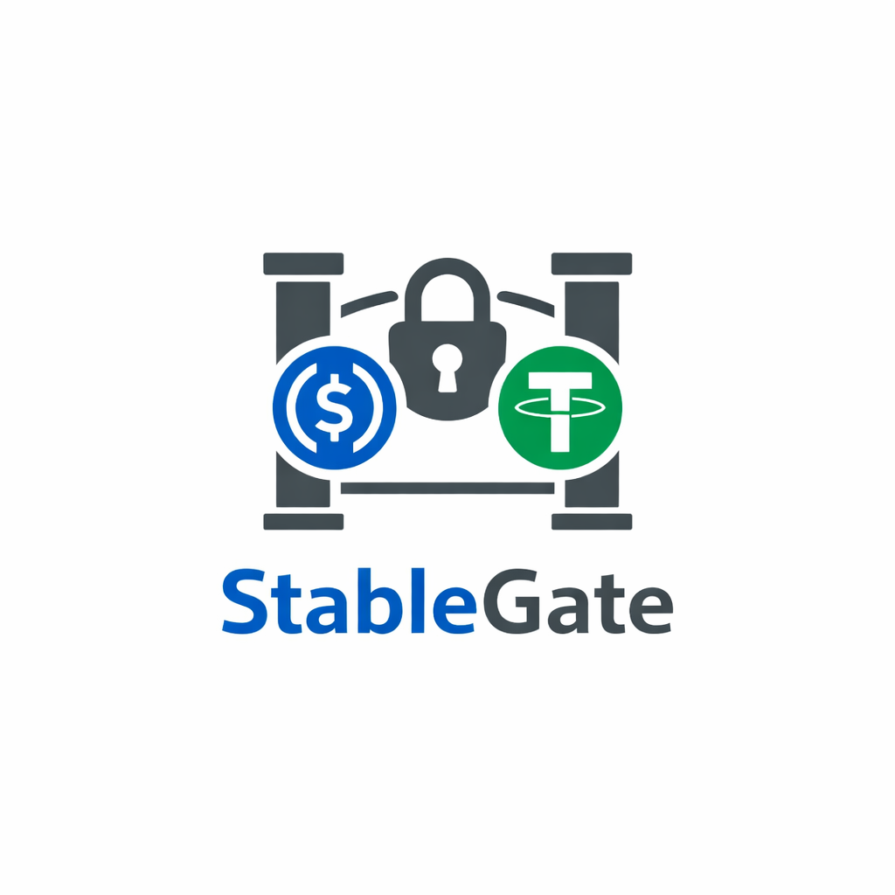

<p align="center">
  
</p>

<h3 align="center">KYC-Gated Institutional Stablecoin Swaps on Uniswap v4</h3>

<p align="center">
  <strong>Base</strong> (credentials) &rarr; <strong>Reactive Network</strong> (automation) &rarr; <strong>Unichain</strong> (execution)
</p>

---

## What is StableGate?

StableGate is **permissioned stablecoin swap infrastructure** built on Uniswap v4 hooks. Institutions earn verified access to a 1:1 USDC/USDT0 Constant Sum Market Maker by minting credential NFTs on Base. The entire onboarding, tier assignment, and revocation lifecycle is automated cross-chain by Reactive Network &mdash; zero manual steps between credential issuance and swap execution.

### The Problem

Institutional stablecoin trading faces a tension: DeFi offers efficient execution but can't enforce compliance; CeFi offers compliance but sacrifices transparency. There's no way to have permissioned access **and** on-chain execution without manual admin overhead.

### How StableGate Solves It

1. **Credential NFTs on Base** &mdash; `MembershipNFT` (trading) and `LPMembershipNFT` (liquidity) are non-transferable ERC721 tokens representing verified institutional relationships
2. **Reactive Network automation** &mdash; A Reactive Smart Contract monitors NFT events on Base and delivers callbacks to Unichain automatically &mdash; allowlisting, tier forwarding, expiry sync, and revocation
3. **Uniswap v4 hook enforcement** &mdash; `PermissionedCSMMHook` enforces all rules on-chain: allowlist gates, tiered fees, membership expiry, daily volume caps, and LP whitelist

---

## Architecture

```
Base Sepolia                      Reactive Lasna                   Unichain Sepolia
────────────────                  ──────────────────               ──────────────────────
MembershipNFT ─── mint ────────► AllowlistReactive ── callback ──► PermissionedCSMMHook
(Trading NFT)     Transfer        Contract             addToAllowlist   beforeSwap()
(Tiered, Expiry)  TierUpdated     (4 subscriptions)    setTier          checks allowlist
                  ExpirySet                             setExpiry        applies tier fee
                                                                        enforces daily cap
LPMembershipNFT ─ mint ────────► (same RSC) ──── callback ──────► beforeAddLiquidity()
(LP NFT)          Transfer                       addToLPWhitelist  checks lpWhitelist

                  burn ─────────► (same RSC) ──── callback ──────► removeFromAllowlist
                                                                   atomic state cleanup
```

---

## Unichain Integration

StableGate uses **Uniswap v4 hooks** on Unichain as the core execution layer. Here's exactly where and how:

### `PermissionedCSMMHook.sol` &mdash; The Hook Contract

| Hook Function | What It Does | Code Reference |
|--------------|-------------|----------------|
| `beforeSwap()` | Checks allowlist, verifies expiry, enforces daily volume cap, computes tier-based fee, executes 1:1 CSMM pricing via NoOp pattern | [`src/PermissionedCSMMHook.sol:167-241`](src/PermissionedCSMMHook.sol) |
| `beforeAddLiquidity()` | Checks `lpWhitelist[lp]` &mdash; only LP-credentialed institutions can provide liquidity | [`src/PermissionedCSMMHook.sol:141-150`](src/PermissionedCSMMHook.sol) |

### CSMM (Constant Sum Market Maker) Implementation

The hook implements 1:1 stablecoin pricing using the **NoOp pattern** &mdash; it fully handles the swap, bypassing the AMM curve:

```
1. poolManager.take(input)       ← pull input tokens from PoolManager to hook
2. compute fee (tier-based)      ← Gold: 0 bps, Silver: 1 bps, Bronze: 3 bps
3. split fee 50/50               ← LP share via donate(), operator share accrued
4. poolManager.donate(lpShare)   ← distribute LP fees proportionally to LPs
5. sync → transfer → settle      ← push output tokens (minus fee) to PoolManager
6. return BeforeSwapDelta        ← tell PoolManager the hook handled everything
```

### Fee Split via `donate()`

Every non-Gold swap fee is split:
- **50% to LPs** &mdash; returned to the pool via `poolManager.donate()`, distributed proportionally to in-range liquidity providers
- **50% to operator** &mdash; accrued in `accruedFees[currency]`, withdrawable anytime via `withdrawFees()`

### Tiered Fee & Volume System

| Tier | Fee (bps) | Daily Volume Cap | Derived From |
|------|-----------|------------------|-------------|
| Gold | 0 | Unlimited | `DAILY_LIMIT_GOLD = 0` |
| Silver | 1 | 5,000,000 USDC | `DAILY_LIMIT_SILVER = 5_000_000e6` |
| Bronze | 3 | 1,000,000 USDC | `DAILY_LIMIT_BRONZE = 1_000_000e6` |

### Two Independent Credentials

| NFT | Governs | Hook Check | Can Hold Both? |
|-----|---------|-----------|----------------|
| `MembershipNFT` | Swap access | `beforeSwap` &rarr; `allowlist[swapper]` | Yes |
| `LPMembershipNFT` | LP access | `beforeAddLiquidity` &rarr; `lpWhitelist[lp]` | Yes |

Revoking one doesn't affect the other. Each credential has its own lifecycle.

### Pool Configuration

```
Pool: MockUSDC / MockUSDT0
Price: 1:1 (sqrtPriceX96 for equal decimals)
Fee: 100 (0.01%)
Tick Spacing: 1
Hook: PermissionedCSMMHook (CREATE2 deployed with address-encoded permission flags)
```

---

## Reactive Network Integration

StableGate uses **Reactive Network** to automate cross-chain state synchronization. Here's exactly where and how:

### `AllowlistReactiveContract.sol` &mdash; The Reactive Smart Contract

The RSC extends `AbstractReactive` and subscribes to **4 event streams** on Base Sepolia:

| # | Event | Source Contract | Callback Emitted | Hook Function Called |
|---|-------|----------------|-------------------|---------------------|
| 1 | `Transfer(from, to, tokenId)` | MembershipNFT | `addToAllowlistReactive` or `removeFromAllowlistReactive` | Allowlist add/remove + atomic state cleanup |
| 2 | `TierUpdated(institution, tier)` | MembershipNFT | `setInstitutionTier` | Set fee tier on hook |
| 3 | `ExpirySet(institution, expiry)` | MembershipNFT | `setInstitutionExpiry` | Set expiry timestamp on hook |
| 4 | `Transfer(from, to, tokenId)` | LPMembershipNFT | `addToLPWhitelist` or `removeFromLPWhitelist` | LP whitelist add/remove |

**Key design: `log._contract` routing** &mdash; Subscriptions 1 and 4 use the same `Transfer` topic but different origin contracts. The RSC distinguishes them by checking `log._contract`:

```solidity
if (log._contract == membershipNFT) {
    // Trading credential → allowlist callbacks
} else if (log._contract == lpMembershipNFT) {
    // LP credential → LP whitelist callbacks
}
```

### Callback Authorization

The hook extends `AbstractCallback` from the Reactive library:

- **`rvmIdOnly(rvm_id)`** modifier on all callback functions
- `rvm_id` is set to the deployer address in the constructor
- Reactive Network replaces the first argument of every callback with the RSC deployer's address
- All callback function signatures include `address rvm_id` as the first parameter

```solidity
function addToAllowlistReactive(address _rvm_id, address institution)
    external rvmIdOnly(_rvm_id) { ... }
```

### Atomic Revocation

When a MembershipNFT is burned on Base:

```
Base: burn(tokenId)
  → Transfer(institution, 0x0, tokenId)
    → RSC.react() detects burn
      → emit Callback: removeFromAllowlistReactive(rvm_id, institution)
        → Hook._removeFromAllowlist():
            allowlist[addr] = false
            institutionTier[addr] = Bronze     ← safe default
            institutionExpiry[addr] = 0        ← cleared
            dailyVolume[addr] = 0              ← cleared
            lastResetBlock[addr] = 0           ← cleared
            emit InstitutionStateCleared(addr)
```

Re-onboarding always starts from a clean slate.

### Callback Proxy Funding

The Unichain callback proxy charges the hook contract for gas on every callback delivery. The deploy script pre-funds the hook's reserves on the proxy:

```solidity
callbackProxy.call{value: 0.005 ether}(
    abi.encodeWithSignature("depositTo(address)", address(hook))
);
```

---

## Contracts

| Contract | Chain | Lines | Description |
|----------|-------|-------|-------------|
| [`PermissionedCSMMHook.sol`](src/PermissionedCSMMHook.sol) | Unichain | ~350 | v4 hook &mdash; CSMM, allowlist, tiers, fees, expiry, daily caps, LP whitelist, fee split, atomic revocation |
| [`MembershipNFT.sol`](src/MembershipNFT.sol) | Base | ~135 | Trading credential &mdash; tiered ERC721, non-transferable, with expiry |
| [`LPMembershipNFT.sol`](src/LPMembershipNFT.sol) | Base | ~65 | LP credential &mdash; binary ERC721, non-transferable |
| [`AllowlistReactiveContract.sol`](src/AllowlistReactiveContract.sol) | Reactive Lasna | ~225 | RSC &mdash; 4 subscriptions, event routing, callback emission |
| [`IStableGate.sol`](src/interfaces/IStableGate.sol) | &mdash; | ~38 | Shared Tier enum, errors, events |
| [`MockUSDC.sol`](src/mocks/MockUSDC.sol) | Unichain | ~20 | 6-decimal testnet USDC with public mint |
| [`MockUSDT0.sol`](src/mocks/MockUSDT0.sol) | Unichain | ~20 | 6-decimal testnet USDT0 with public mint |

---

## Test Suite

**151 tests** across 7 suites:

| Suite | Tests | Coverage |
|-------|-------|---------|
| `PermissionedCSMMHookTest` | 71 | Allowlist, tiers, fees, expiry, daily limits, fee split/withdraw, LP whitelist, `beforeAddLiquidity`, credential independence, atomic revocation |
| `MembershipNFTTest` | 22 | Mint, revoke, tiers, expiry, transfer lock, `ExpirySet` event |
| `AllowlistReactiveContractTest` | 22 | Mint/burn/transfer routing, tier forwarding, expiry forwarding, LP routing, payload encoding |
| `ForkDemoTest` | 13 | Multi-chain fork &mdash; real mainnet USDC/USDT0, full lifecycle including LP access control |
| `LPMembershipNFTTest` | 11 | Mint, revoke, transfer lock, admin |
| `MockTokensTest` | 10 | Decimals, mint, transfer, name/symbol |
| `DeployScripts` | 2 | Deployment script compilation |

```bash
forge test -vvv   # Run all 151 tests
```

---

## Setup & Demo Guide

### Prerequisites

| Tool | Version | Install |
|------|---------|---------|
| Node.js | 20+ | https://nodejs.org |
| Foundry | Latest | `curl -L https://foundry.paradigm.xyz \| bash && foundryup` |
| Yarn | 1.x+ | `npm install -g yarn` |
| jq | Any | `brew install jq` (macOS) |

### Wallets

You need **5 wallets** (generate with `cast wallet new`):

| Wallet | Purpose | Funding Needed |
|--------|---------|---------------|
| **Operator** | Deploys contracts, admin ops | ETH on Base Sepolia + Unichain Sepolia + lREACT on Reactive Lasna |
| **Institution Bronze** | Trades with 3 bps fee | ETH on Unichain Sepolia (tokens minted by deploy script) |
| **Institution Silver** | Trades with 1 bps fee | ETH on Unichain Sepolia |
| **Institution Gold** | Trades with 0 fee | ETH on Unichain Sepolia |
| **Institution LP** | Seeds pool liquidity | ETH on Unichain Sepolia |

**Faucets:**

| Asset | Source |
|-------|--------|
| Base Sepolia ETH | [Coinbase Faucet](https://www.coinbase.com/faucets/base-ethereum-goerli-faucet) |
| Unichain Sepolia ETH | [Unichain Faucet](https://faucet.unichain.org) |
| lREACT | Send Sepolia ETH to `0x9b9BB25f1A81078C544C829c5EB7822d747Cf434` |

USDC and USDT0 are **not needed from faucets** &mdash; the deploy script mints mock tokens automatically.

### Step 1: Clone & Build

```bash
git clone https://github.com/SamAg19/StableGate.git
cd StableGate
git submodule update --init --recursive
forge build
```

### Step 2: Configure Environment

```bash
cp .env.example .env
```

Fill in your wallet addresses and private keys:

```bash
DEPLOYER_ADDRESS=0x...
DEPLOYER_PRIVATE_KEY=0x...

INSTITUTION_BRONZE=0x...
INSTITUTION_SILVER=0x...
INSTITUTION_GOLD=0x...
INSTITUTION_LP=0x...

BASE_SEPOLIA_RPC=https://base-sepolia-rpc.publicnode.com
UNICHAIN_SEPOLIA_RPC=https://unichain-sepolia-rpc.publicnode.com
REACTIVE_LASNA_RPC=https://lasna-rpc.rnk.dev/
```

### Step 3: Deploy All Contracts

```bash
bash script/deploy-all.sh
```

This deploys across all 3 chains sequentially:
1. **Base Sepolia** &mdash; MembershipNFT + LPMembershipNFT
2. **Unichain Sepolia** &mdash; MockUSDC, MockUSDT0, PermissionedCSMMHook, pool init, hook reserve seeding, callback proxy funding
3. **Reactive Lasna** &mdash; AllowlistReactiveContract

State is saved to `deployments.json`. If Reactive deploy fails, retry with:
```bash
bash script/deploy-all.sh --reactive
```

### Step 4: Mint Tokens to LP Institution

The deploy script mints tokens to the 3 tier institutions automatically. Mint separately for the LP institution:

```bash
cast send $USDC_ADDRESS "mint(address,uint256)" $INSTITUTION_LP 500000000000 \
  --rpc-url $UNICHAIN_SEPOLIA_RPC --private-key $DEPLOYER_PRIVATE_KEY
cast send $USDT0_ADDRESS "mint(address,uint256)" $INSTITUTION_LP 500000000000 \
  --rpc-url $UNICHAIN_SEPOLIA_RPC --private-key $DEPLOYER_PRIVATE_KEY
```

### Step 5: Set Up Demo

```bash
cd demo
yarn install
cp .env.example .env   # Fill in all addresses + private keys from deploy output
```

Extract ABIs from compiled contracts:
```bash
cd .. && forge build && bash demo/scripts/extract-abis.sh && cd demo
```

### Step 6: Run the Tests

Before running the live demo, verify everything works locally:

```bash
# Run all 151 tests
forge test -vvv
```

**Fork tests** simulate the entire cross-chain lifecycle using real mainnet USDC/USDT0 on forked Base and Unichain:

```bash
forge test --match-contract ForkDemoTest -vvv
```

The fork demo proves (without any testnet deployment):
- Non-allowlisted swap rejected
- MembershipNFT minted on Base fork &rarr; RSC `react()` emits Callback
- Callback delivered to hook (simulated via `vm.prank`) &rarr; institution allowlisted
- Gold tier: 10,000 USDC &rarr; 10,000 USDT0 (1:1, zero fee)
- Bronze tier: 10,000 USDC &rarr; 9,997 USDT0 (3 bps fee deducted)
- Reverse swap: 5,000 USDT0 &rarr; 5,000 USDC
- Expired membership reverts with `MembershipExpired`
- Daily volume cap enforced (second swap blocked at cap)
- LP whitelist: whitelisted LP adds liquidity, non-whitelisted blocked
- Revoked institution blocked, existing LP positions untouched
- Trading and LP credentials are independent

To run just the unit tests (no network fork required):
```bash
forge test --match-contract "PermissionedCSMMHookTest|MembershipNFTTest|LPMembershipNFTTest|AllowlistReactiveContractTest|MockTokensTest" -vvv
```

### Step 7: Run the Demo

**Full 4-phase demo** (LP &rarr; Gold &rarr; Silver &rarr; Bronze):
```bash
bash scripts/run-demo.sh
```

**Individual runs:**
```bash
yarn demo                                # Silver tier (default)
yarn demo --tier=gold                    # Gold tier
yarn demo --tier=bronze                  # Bronze tier
yarn demo --only=lp                      # LP steps only (1-3)
yarn demo --only=trading --tier=gold     # Trading only, Gold
yarn demo --fresh                        # Ignore snapshot, start from step 1
```

---

## Demo Walkthrough

The demo runs **6 steps** in two phases:

### Phase 1: LP Initialization (Steps 1-3)

Uses the dedicated LP institution (500k USDC + 500k USDT0).

| Step | Chain | What You See |
|------|-------|-------------|
| **1. Mint LP NFT** | Base Sepolia | Admin mints `LPMembershipNFT` &rarr; Transfer event emitted |
| **2. Wait for callback** | Unichain Sepolia | Polls `isLPWhitelisted()` with spinner + Reactscan link (~15-45s) |
| **3. Add liquidity** | Unichain Sepolia | 50k USDC + USDT0 deposited via PositionManager with Permit2 flow |

### Phase 2: Trading (Steps 4-6)

Uses the tier-specific institution (Gold/Silver/Bronze).

| Step | Chain | What You See |
|------|-------|-------------|
| **4. Mint Trading NFT** | Base Sepolia | Admin mints `MembershipNFT` with tier &rarr; 3 events emitted |
| **5. Wait for callbacks** | Unichain Sepolia | Polls `isAllowlisted()` + `institutionTier()` with Reactscan link |
| **6. Execute swap** | Unichain Sepolia | 10k USDC &rarr; USDT0 swap &mdash; shows fee deduction + 50/50 split |

### What the Demo Proves

| Claim | How It's Demonstrated |
|-------|----------------------|
| **Zero-touch onboarding** | Mint NFT on Base &rarr; institution can swap on Unichain within 15-45s, no admin calls needed |
| **Tiered fees work** | Gold: 10,000 received. Silver: 9,999 received (1 bps). Bronze: 9,997 received (3 bps) |
| **LP access is separate** | LP institution adds liquidity; trading institutions can only swap |
| **Fee economics** | Every fee split 50/50: LP share via `donate()`, operator share via `accruedFees` |
| **Cross-chain automation** | Reactscan link shows RSC activity live during the wait steps |

### Presenter Tips

1. **Open Reactscan** during Steps 2 and 5 to show callbacks arriving in real-time
2. **Run `run-demo.sh`** for the full showcase &mdash; all 3 fee tiers back-to-back
3. **Compare the swap outputs** across Gold/Silver/Bronze to highlight fee differences
4. **Point out `hookData`** &mdash; `abi.encode(institutionAddress)` is how the hook identifies who's swapping
5. If a step was already completed (institution already minted), the demo **skips it automatically** and proceeds

---

## Repository Structure

```
StableGate/
├── src/
│   ├── PermissionedCSMMHook.sol          # Uniswap v4 hook (main contract)
│   ├── MembershipNFT.sol                 # Trading credential NFT (Base)
│   ├── LPMembershipNFT.sol              # LP credential NFT (Base)
│   ├── AllowlistReactiveContract.sol     # Reactive Smart Contract
│   ├── interfaces/IStableGate.sol        # Shared types and events
│   └── mocks/MockUSDC.sol, MockUSDT0.sol # Testnet tokens
├── test/                                  # 151 tests (7 suites)
├── script/
│   ├── deploy-all.sh                     # One-command 3-chain deployment
│   ├── DeployBase.s.sol                  # Base Sepolia
│   ├── DeployUnichain.s.sol              # Unichain Sepolia
│   └── DeployReactive.s.sol              # Reactive Lasna
└── demo/
    ├── scripts/run-demo.sh               # Full 4-phase demo runner
    ├── src/
    │   ├── index.ts                      # Entry point (--tier, --only, --fresh)
    │   ├── config.ts                     # Chains, constants, institutions
    │   ├── clients.ts                    # 3 public + 5 wallet clients
    │   ├── utils.ts                      # Uniswap v4 SDK integration
    │   ├── steps/step1-6.ts             # Demo step implementations
    │   ├── snapshot.ts                   # Resume-on-failure system
    │   └── poller.ts                     # Cross-chain polling with spinner
    └── abis/                             # Contract ABIs
```

---

## Sponsor Tracks

### Unichain

- **Uniswap v4 hook** implementing CSMM pricing with permissioned access, tiered fees, and LP whitelist
- **Fee split via `donate()`** &mdash; LP share returned to pool proportionally, operator share accrued for withdrawal
- **NoOp swap pattern** &mdash; hook fully controls execution, bypassing the AMM curve for 1:1 stablecoin pricing
- **`beforeAddLiquidity` LP gate** &mdash; separate credential for liquidity provision
- **CREATE2 deployment** with HookMiner for address-encoded permission flags
- **151 tests** including 13 mainnet fork tests with real USDC/USDT0

### Reactive Network

- **4-subscription RSC** monitoring two NFT contracts across chains
- **`log._contract` routing** &mdash; same Transfer topic, different origin contract, different callback paths
- **AbstractCallback + rvmIdOnly** for secure callback authorization
- **Atomic revocation** &mdash; NFT burn on Base triggers full state cleanup on Unichain in one callback
- **Live testnet demo** with Reactscan monitoring links during cross-chain wait steps

---

## License

MIT
